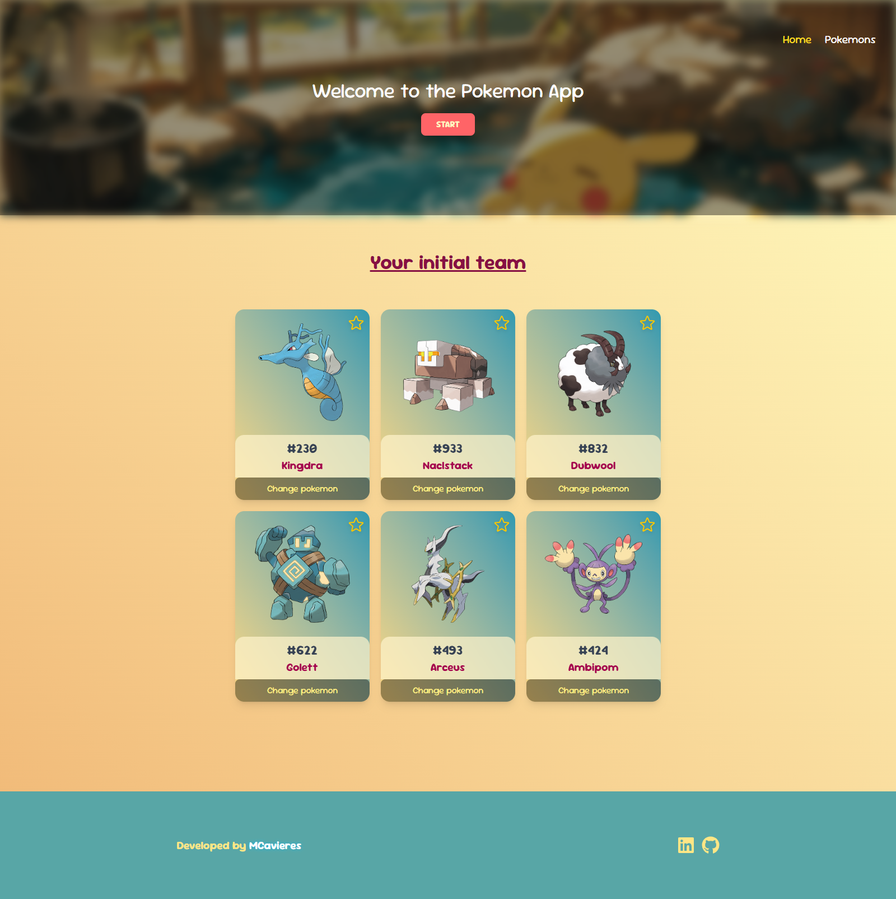
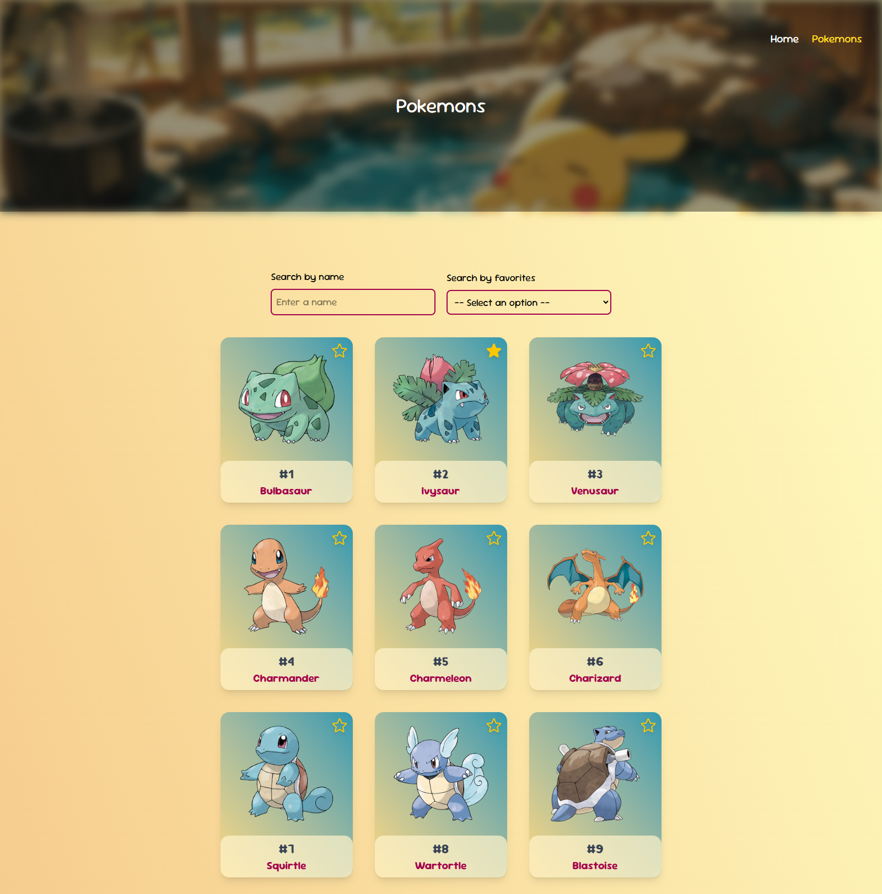
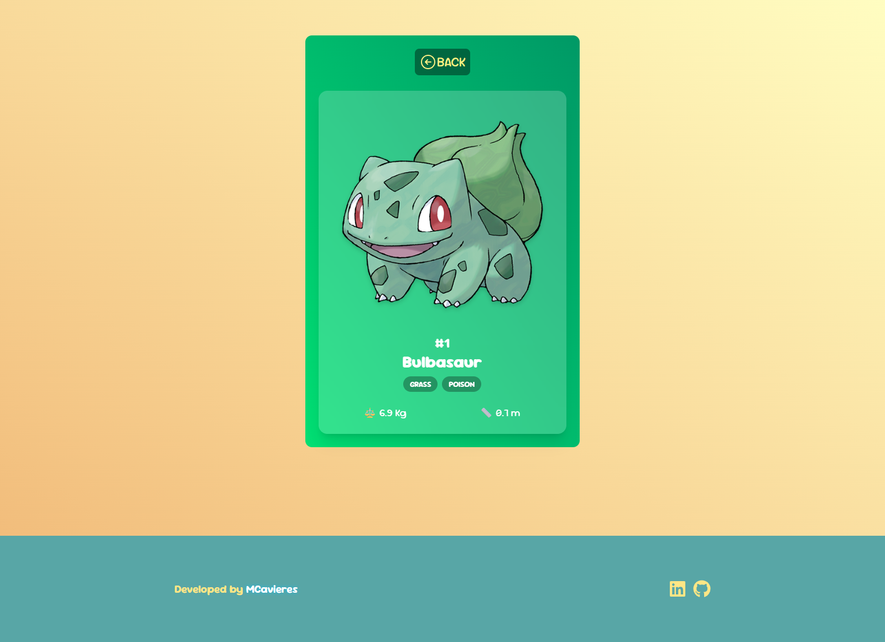

# 🐾 Pokémon App

¡Bienvenido a la **Pokémon App**! 🎉  
Explora, filtra y descubre todos los Pokémon como un verdadero entrenador Pokémon. ¡Prepárate para tu aventura!

---

## 🎯 Funcionalidades principales

-   **Lista de Pokémon**: Navega por todos los Pokémon disponibles y explora sus detalles.
-   **Buscador inteligente**: Filtra por nombre y encuentra tu Pokémon favorito al instante.
-   **Pokedex**: Visualiza la información completa de cada Pokémon:
    -   Número
    -   Nombre
    -   Tipo(s)
    -   Imagen
    -   Peso (WT)
    -   Altura (HT)
-   **Navegación fácil**: Vuelve a la lista o la página principal con un solo clic.
-   **Interfaz amigable**: Diseño limpio, responsivo y con un toque Pokémon.

---

## 🛠 Tecnologías usadas

-   **Frontend**: React, TypeScript, Tailwind CSS
-   **Routing**: React Router
-   **Estado global**: Zustand
-   **API**: PokéAPI para obtener datos de Pokémon
-   **Testing**: React Testing Library & Jest
-   **Herramientas**: Vite para bundling y optimización

---

## ⚡ Instalación y uso

1. Clona el repositorio:

```bash
git clone https://github.com/tu-usuario/pokemon-app.git
```

2. Instala dependencias:

```bash
npm install
```

3. Instala dependencias:

```bash
npm run dev
```

4. Abre tu navegador en http://localhost:5173
   y ¡comienza la aventura! 🚀

## 🌟 Vista previa

**Home Page:**  
Muestra la bienvenida y un botón para comenzar tu viaje Pokémon.



**Pokegrid:**  
Detalle completo de cada Pokémon, con su tipo, descripción, altura, peso y más.


**Pokedex:**  
Encuentra rápidamente a tu Pokémon favorito y navega por toda la lista.


---

## 🎉 Créditos

-   Inspirado en la **PokéAPI** 🐱‍👤
-   Diseñado y desarrollado por [MCavieres](https://www.linkedin.com/in/macarena-cavieres-rubio/)
